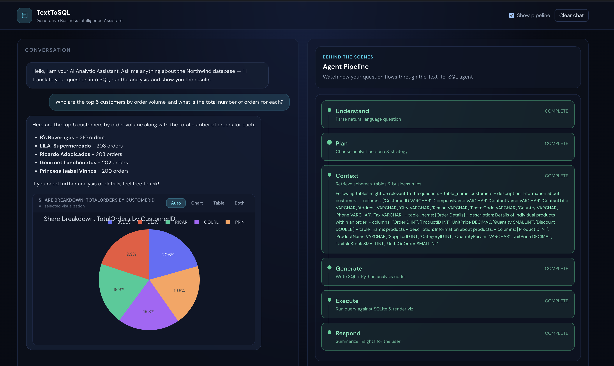
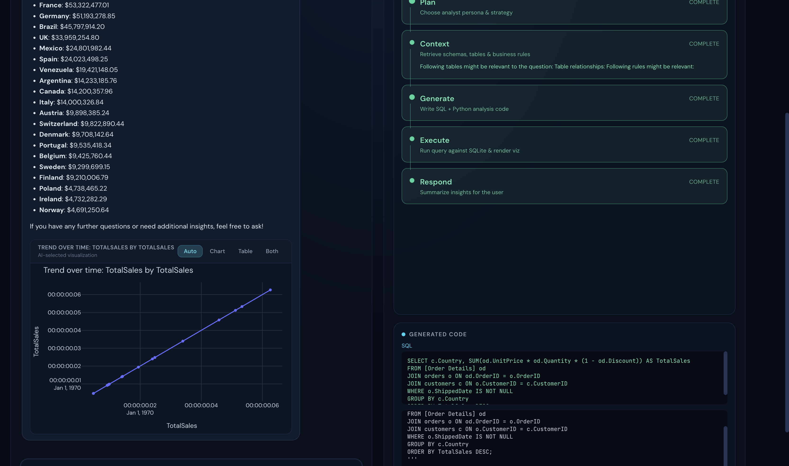

# Analytic Copilot

**Generative BI assistant** that turns natural-language questions into trusted SQL, charts, and answers — not as a one-shot Text-to-SQL prompt, but as an **agentic analytic pipeline** that plans, retrieves schema context, generates code, executes it, visualizes results, and streams every step so you can see what the model is doing.

Demo data: [Northwind](https://github.com/microsoft/sql-server-samples/tree/master/samples/databases/northwind-pubs) (SQLite).

> Deep dive: [Generative BI Is Not Just Text-to-SQL: Designing an Agentic Analytic Pipeline](https://www.rajkumarsamra.me/blog/generative-bi-agent-text-to-sql-pipeline)

---

## Screenshots

Conversation view with live agent pipeline (understand → plan → context → generate → execute → respond):



Sales-by-country analysis with generated SQL and visualization:



---

## Why not naive Text-to-SQL?

A single prompt that dumps the full schema and asks for SQL fails in predictable ways: schema overload, missing business rules, no execution feedback, no charts, and no trust. Analytic Copilot treats the LLM as a **planner and coder inside a controlled loop**:

| Concept | What it does |
| --- | --- |
| **Tool-mediated agent** | Model must call `retrieve_context` and `execute_python_code` — it does not talk to the DB from free-form text |
| **Structured analytic RAG** | Metadata (`data/metadata.json`) maps business concepts to scenarios, tables, relationships, and rules |
| **Python as the analytic interface** | Agent writes Python; SQL runs via `execute_sql_query()`; charts via `show_to_user()` |
| **Execution / self-correction loop** | Errors and empty results feed back into the agent for repair (bounded retries) |
| **Personas & strategy** | Retrieval-capable coder vs. example-primed coder, switched by runtime state |
| **Visualization as first-class output** | Plotly charts + auto chart suggestions from DataFrame shape |
| **Streaming pipeline UI** | SSE events power a live “behind the scenes” panel for trust and debugging |

```
User question → Understand → Plan → Context retrieval → Generate Python/SQL
       ↑                                                      ↓
       └──────── repair on error ←── Execute ←────────────────┘
                                              ↓
                                    Table / chart → NL answer
```

---

## Architecture

```
┌─────────────────┐     SSE / REST      ┌──────────────────┐
│  React UI       │ ◄─────────────────► │  FastAPI         │
│  (Vite :5173)   │                     │  (uvicorn :8000) │
└─────────────────┘                     └────────┬─────────┘
                                                 │
                                        ┌────────▼─────────┐
                                        │  Smart_Agent     │
                                        │  (copilot_utils) │
                                        └────────┬─────────┘
                                                 │
                          ┌──────────────────────┼──────────────────────┐
                          ▼                      ▼                      ▼
                   Azure OpenAI          metadata.json            SQLite
                   (chat + tools)     (scenarios / rules)      (Northwind)
```

| Path | Role |
| --- | --- |
| `api_server.py` | FastAPI + SSE chat streaming for the React UI |
| `copilot_utils.py` | Agent, tools, context retrieval, code execution |
| `runtime.py` | Request-scoped runtime / display state |
| `visualization_utils.py` | Table/chart payloads for the UI |
| `copilot.py` | Optional Streamlit UI (legacy / alternate front end) |
| `frontend/` | React + Vite chat + pipeline visualization |
| `data/metadata.json` | Analytic scenarios, tables, columns, business rules |
| `data/northwind.db` | Sample SQLite database |

---

## Prerequisites

- Python 3.10+
- Node.js 18+
- Azure OpenAI credentials (chat + embeddings deployments)

---

## Setup

### 1. Clone and configure secrets

```bash
cp secrets.env.sample secrets.env
```

Edit `secrets.env` and set at least:

- `AZURE_OPENAI_ENDPOINT`
- `AZURE_OPENAI_API_KEY`
- `AZURE_OPENAI_GPT4_DEPLOYMENT` / `AZURE_OPENAI_GPT35_DEPLOYMENT`
- `AZURE_OPENAI_EMB_DEPLOYMENT`
- `META_DATA_FILE=data/metadata.json`

Azure AI Search settings are optional depending on your retrieval configuration.

### 2. Backend (API)

```bash
./start-api.sh
```

Creates `.venv` if needed, installs `requirements.txt`, and starts uvicorn on [http://127.0.0.1:8000](http://127.0.0.1:8000).

Or manually:

```bash
python3 -m venv .venv
source .venv/bin/activate
pip install -r requirements.txt
uvicorn api_server:app --reload --host 127.0.0.1 --port 8000
```

### 3. Frontend (React)

```bash
cd frontend && npm install && cd ..
./start-ui.sh
```

Opens the Vite dev server on [http://127.0.0.1:5173](http://127.0.0.1:5173) (proxies `/api` → `:8000`).

### Optional: Streamlit UI

```bash
source .venv/bin/activate
streamlit run copilot.py
```

---

## Sample questions

- What were the total sales for each year available in the database?
- Who are the top 5 customers by order volume, and what is the total number of orders for each?
- What are the top 10 most popular products based on quantity sold?
- What are the total sales broken down by country?

---

## Pipeline stages (UI)

With **Show pipeline** enabled, the right panel streams:

1. **Understand** — parse the natural-language question  
2. **Plan** — choose analyst persona & strategy  
3. **Context** — retrieve schemas, tables & business rules  
4. **Generate** — write SQL + Python analysis code  
5. **Execute** — run against SQLite & render visualization  
6. **Respond** — summarize insights for the user  

---

## License

Use and adapt for learning and demos. Provide attribution if you reuse substantial parts of the design or write-up.
